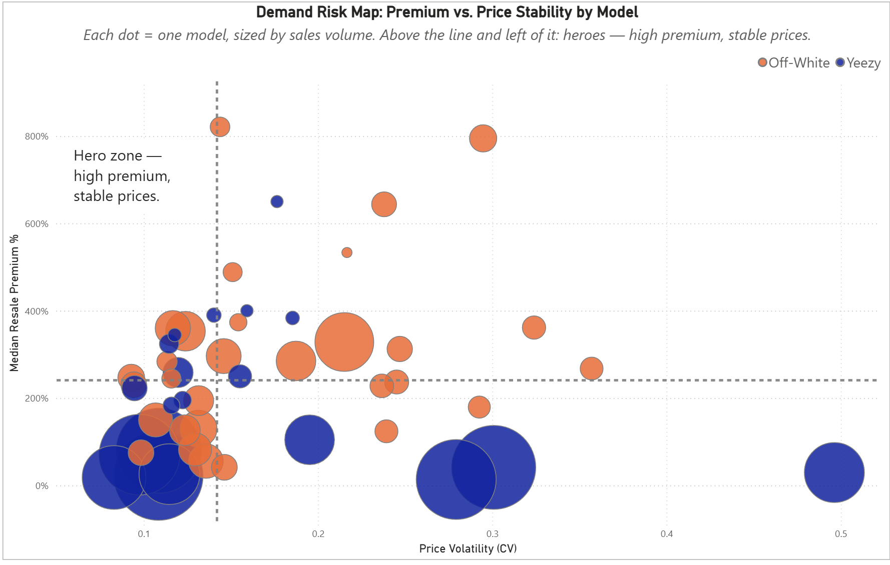
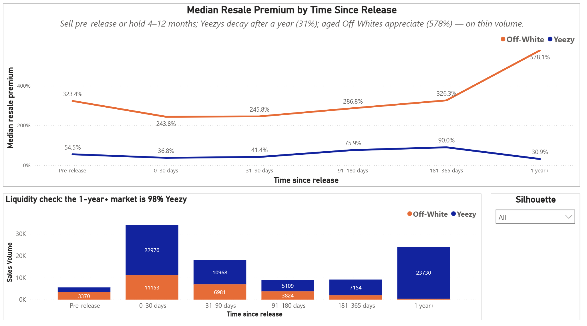
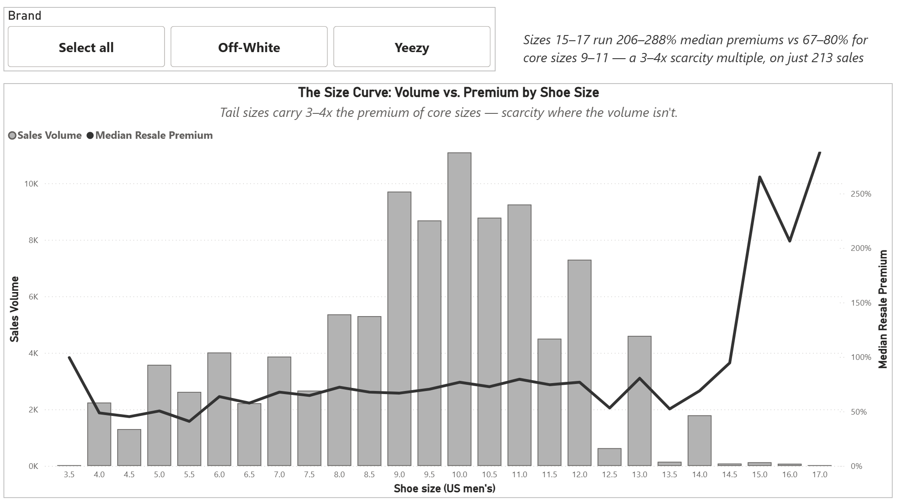
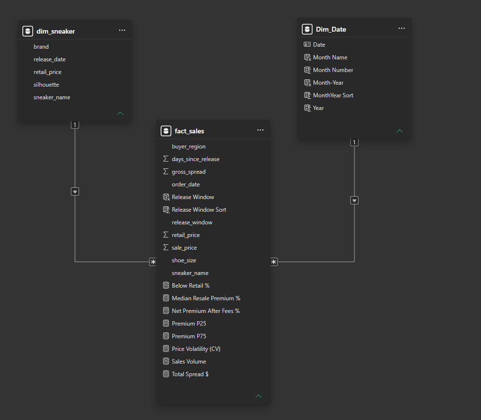

# StockX Sneaker Resale Analytics

Analyzing **99,956 real StockX transactions** to answer three questions every reseller faces: **when to sell, which sizes to buy, and which shoes are risky bets.**



**Stack:** Google BigQuery (SQL) → Power BI (star schema, DAX) · Data: [StockX 2019 Data Contest](https://www.kaggle.com/datasets/hudsonstuck/stockx-data-contest)

---

## Why this project

I've resold sneakers on StockX and eBay for about six years (80+ SKUs), so this dataset describes a market I operated in — every number here was sanity-checked against firsthand experience, including the fee assumptions. The data covers Sept 2017 – Feb 2019: two brands, 50 models, and two opposite playbooks. **Off-White ran a scarcity model** (27,794 sales at fat premiums); **Yeezy ran a volume model** (72,162 sales at thin ones, after adidas deliberately expanded supply in 2018). That contrast is the color language of every chart in the report.

## Business questions

1. **Exit timing** — when is the optimal window to sell after release? *(retail translation: markdown timing / dynamic pricing)*
2. **Size-curve scarcity** — which sizes carry premiums, and does the sweet spot shift by brand? *(size-curve buying)*
3. **Demand risk** — which models are stable and which are gambles? *(demand risk scoring in buy planning)*

**Cut from scope, deliberately:** a brand-only premium comparison (two numbers = a KPI card, not a question), an absolute-dollar "hero" leaderboard (mechanically favors expensive shoes), and geography (regional volume mostly tracks population; a 50-model × 51-region grid is too sparse to trust).

## Key findings

**1. Two playbooks, one market.** Off-White wins on rate — **268.4%** median resale premium vs Yeezy's **43.6%**. Yeezy wins on dollars — **$25.98M** total resale vs **$18.66M**. Rate and revenue are different games, and the demand risk map shows them as two visibly separate clusters.

**2. The premium "collapse" that wasn't.** Market-wide, median premiums appear to collapse to ~31% a year after release. That turned out to be a **composition artifact**: the 1-year+ bucket is **98% Yeezy** (23,730 of 24,185 sales). Split by brand, the stories reverse — aged Yeezys decay like commodities (**30.9%**), while aged Off-Whites appreciate like collectibles (**578.1%**, on just 455 sales). Exit timing is brand-specific: Yeezy sellers exit pre-release or in months 6–12; Off-White holders are paid to wait — if they can accept the illiquidity. The extreme case: Off-White Air Jordan 1s a year after release trade at a **1,189.5%** median premium (n=111).

| Time since release | Off-White | Yeezy |
|---|---|---|
| Pre-release | 323.4% | 54.5% |
| 0–30 days | 243.8% | 36.8% |
| 31–90 days | 245.8% | 41.4% |
| 91–180 days | 286.8% | 75.9% |
| 181–365 days | 326.3% | 90.0% |
| 1 year+ | **578.1%** | **30.9%** |



**3. Scarcity lives at the tails of the size curve.** Core sizes 9–11 carry 66.8–79.5% median premiums on ~30K sales. Tail sizes 15–17 carry **206–288%** — a 3–4x multiple — on just 213 sales. The size curve is also brand-shaped: size 15 is **100% Off-White** (130 sales, zero Yeezys). Size 17's 287.7% rests on n=4, disclosed accordingly.



**4. The market almost never loses.** Only **0.56%** of 99,956 sales closed below retail. Total retail value of $20.85M flipped for $44.64M — a $23.79M aggregate spread.

*Footnote on medians: the all-market median premium is 70.5%, which is not "between" the brand medians of 43.6% and 268.4% in any weighted-average sense — a pooled median is not an average of medians. Yeezy is 72% of all rows, so the pooled middle lands near Yeezy's 69th percentile.*

## Data & cleaning

Source: 99,956 rows released publicly by StockX for their 2019 Data Contest ([Kaggle](https://www.kaggle.com/datasets/hudsonstuck/stockx-data-contest)). Full column reference in [`data/data-dictionary.md`](data/data-dictionary.md). Three genuine defects, all evidenced in [`sql/validation.sql`](sql/validation.sql):

| Defect | Impact | Fix |
|---|---|---|
| `' Yeezy'` leading space on **all 72,162** Yeezy rows | Groupings look normal, but any `brand = 'Yeezy'` filter or join silently returns zero rows | `TRIM()` in the staging view; confirmed via bracket test on raw data |
| Inconsistent model-name capitalization (`Adidas-` vs `adidas-`) | Breaks case-sensitive pattern matching | Silhouette parsing matches on `LOWER()` |
| Prices/dates stored as text (`$1,097`, `9/1/17`) | Not directly analyzable | Typed at load by BigQuery schema detection |

## Pipeline

```
raw_sales (loaded table)
   └── stg_sales (view: renaming, TRIM, type casting)
         ├── dim_sneaker (50 rows: brand, retail, release date, parsed silhouette)
         └── fact_sales (99,956 rows: prices, spread, days-since-release + timing buckets)
```

The staging view is the shock absorber: when the loaded schema turned out to differ from the plan (auto-typed dates and prices), only staging changed — both marts and everything downstream were untouched. Validation: five checks (row counts, dimension integrity, NULL audit, financial reconciliation, raw-defect evidence), with headline numbers verified through independent paths — Python profile vs SQL vs the Power BI model.

## Star schema & DAX



`dim_sneaker` (1) → (*) `fact_sales` ← (1) `Dim_Date` (DAX `CALENDAR()`, marked as date table). Silhouette parsing expands 2 brands into 11 product families. Measures (full formulas in [`dax/measures.md`](dax/measures.md)):

- **Median Resale Premium %** — `MEDIANX` over per-transaction markup; median because prices are heavily right-skewed.
- **Net Premium After Fees %** — the dataset has no fees, so seller economics are modeled with a disclosed **12.5%** fee assumption (9.5% transaction + 3% processing, the 2017–2019 schedule, known from my own payout records).
- **Price Volatility (CV)** — stdev ÷ mean of sale price per model; dividing by the mean makes a $250 and a $1,500 shoe comparable, where raw stdev would just re-rank by price level.
- Reference lines on the risk map are the **medians of the 50 model-level values** (240.79% / 0.142), so each axis splits the catalog in half.

## Limitations

No marketplace fees in the data (assumption disclosed above); no seller identifiers; no inventory levels; no basket structure. Data ends Feb 2019 — these are the market's patterns, not current prices. Two brands is the dataset's scope, treated here as focus. CV assumes the mean is a sensible center and can overstate risk for heavily skewed models. Thin-sample findings carry their n (size 17: n=4; aged Off-White: n=455).

## Reproduce

The Power BI file points at my BigQuery project. To rebuild: create a BigQuery dataset, load `data/StockX-Data-Contest-2019-3.csv` with schema auto-detect, run the scripts in `sql/` in order (staging → dim → fact → validation), and repoint the .pbix connection `reports/stockx-resale-analytics.pbix` — or just view the report screenshots in `images/`.
This project runs on BigQuery's free sandbox tier with no billing account attached; live tables expire September 7, 2026 (confirmed via console). All SQL scripts in /sql fully rebuild the pipeline from the included CSV in minutes if the original tables have expired.
